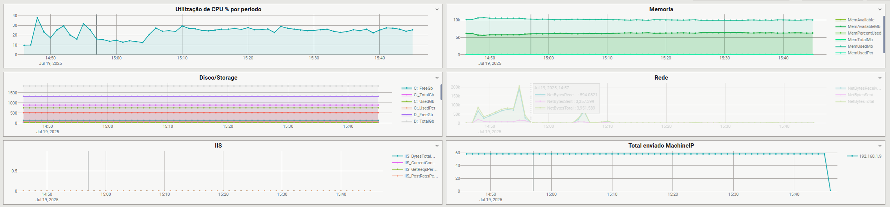
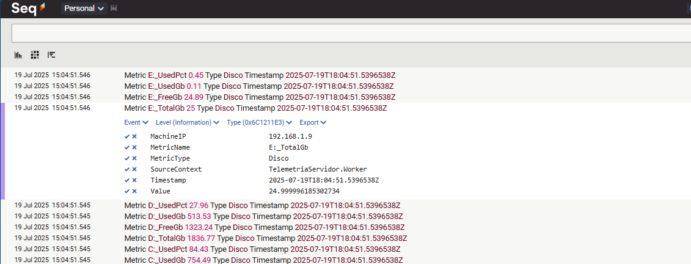

<!---- Badges (substitua SEU_USUARIO e REPO) -->


# TelemetriaServidor – Windows Service → SEQ

Serviço Windows em **.NET 8** que coleta métricas do sistema operacional (CPU, memória, disco, rede, IIS, serviços, *Performance Counters*) e publica no [**SEQ**](https://datalust.co/seq) via Serilog.

---

## 1 · Funcionalidades

| Categoria    | Métricas publicadas (nome ➜ contador)                                                                         | Intervalo padrão |
| ------------ | ------------------------------------------------------------------------------------------------------------- | ---------------- |
| **CPU**      | `CpuTotal` ➜ **% Processor Time**`CpuUser` ➜ **% User Time**                                                  | 30 s             |
| **Memória**  | `MemAvailableMb` ➜ **Available MBytes**`MemPercentUsed` ➜ **% Committed Bytes In Use**                        | 30 s             |
| **Disco**    | `DiskBusyPct` ➜ **% Disk Time**`DiskReadSec` ➜ **Avg. Disk sec/Read**`DiskWriteSec` ➜ **Avg. Disk sec/Write** | 60 s             |
| **Rede**     | `NetBytesSent` / `NetBytesReceived` / `NetBytesTotal` ➜ \**Bytes **/sec*                                      | 60 s             |
| **IIS**      | `IIS_CurrentConnections`, `IIS_GetReqsPerSec`, `IIS_PostReqsPerSec`, `IIS_BytesTotalPerSec`                   | 60 s             |
| **Serviços** | Estado (`Running/Stopped`) dos serviços listados em **WatchedServices**                                       | 30 s             |

*Todos os intervalos e métricas são ****100 % configuráveis**** no **`appsettings.json`**; veja seção 2.*

---

## 2 · Configurações

### 2.1 Configurar o endereço do SEQ

Abra `` e altere a URL em **Serilog → WriteTo → Seq → serverUrl**  🡒

```jsonc
"Serilog": {
  "WriteTo": [
    {
      "Name": "Seq",
      "Args": {
        "serverUrl": "http://<IP_DO_SEQ>:5341",   // <‑‑ troque aqui
        "apiKey": ""                               // se usar API‑Key
      }
    }
  ]
}
```

> ⚠️ O serviço precisa ter acesso HTTP (ou HTTPS) até a porta 5341 do SEQ. Devem no mínimo estar na mesma rede caso o SEQ não seja em uma url publica.

### 2.2 Adicionar uma nova métrica

Para coletar **% Privileged Time** do processador como `CpuKernel`:

```jsonc
{
  "Category": "Processor",          // categoria Performance Counter
  "Counter": "% Privileged Time",   // nome exato no PerfMon
  "Instance": "_Total",             // pode ser vazio para 1º instância
  "MetricName": "CpuKernel",        // nome amigável exibido no SEQ
  "MetricType": "CPU"               // usado para filtragem/cor
}
```

Coloque o bloco acima dentro do array **Telemetry → Metrics** no arquivo appsettings.json e reinicie o serviço.

⚠️ Não encontrou sua NIC?

> Dependendo do Windows, o nome da instância (`"Instance": "Realtek …"`) pode
> vir diferente ou conter traço extra.  Abra um prompt e execute:
>
> ```powershell
> # lista todos os contadores de rede
> typeperf -qx "Network Interface"
> # ou, no PowerShell moderno:
> (Get-Counter -ListSet "Network Interface").Counter
> ```
>
> Copie o texto exato entre aspas que aparece após `Network Interface(` e cole
> no campo **Instance**.  Se ainda assim não for encontrado, deixe o valor
> vazio (`""`) para o serviço usar a primeira NIC disponível e ajuste o nome
> exibido em `MetricName` manualmente.
...
```jsonc
{
  "Category": "Network Interface",
  "Counter": "Bytes Sent/sec",
  "Instance": "Realtek 8852BE Wireless LAN WiFi 6 PCI-E NIC",
  "MetricName": "NetBytesSent",
  "MetricType": "Rede"
}
```

### 2.3 Instalando o serviço no Windows

```powershell
# 1. Compile em Release
cd "C:\Src\TelemetriaServidor"
dotnet publish -c Release -o C:\Apps\TelemetriaServidor

# 2. Crie o serviço
sc create TelemetriaServidor binPath= "C:\Apps\TelemetriaServidor\TelemetriaServidor.exe" start= auto

# 3. Inicie
sc start TelemetriaServidor
```

*Para atualizar basta parar (**`sc stop`**) e substituir os arquivos.*

---

## 3 · Como interpretar cada métrica

| Métrica                             | Categoria | Como analisar                                                                                         |
| ----------------------------------- | --------- | ----------------------------------------------------------------------------------------------------- |
| **CpuTotal**                        | CPU       | Acima de 80 % por períodos longos indica gargalo de CPU; verifique processos consumidores.            |
| **MemAvailableMb / MemPercentUsed** | Memória   | MB livres < 500 MB **ou** % usados > 85 % alerta para upgrade ou ajuste em processos com leak.        |
| **DiskBusyPct**                     | Disco     | > 70 % sustentável sinaliza disco subdimensionado; combine com *DiskRead/WriteSec* para ver latência. |
| **NetBytesTotal**                   | Rede      | Pico próximo ao throughput da NIC indica necessidade de link maior ou QoS.                            |
| **IIS\_CurrentConnections**         | IIS       | Crescendo continuamente pode indicar fila de requests; correlacione com *Queue Length*.               |
| **ServiceStatus (WatchedServices)** | Serviços  | Mudança para *Stopped* gera alerta; configure alerta no SEQ para reinício automático.                 |

> Consulte *Performance Monitor* da Microsoft para limites oficiais de cada contador. [Performance Monitor Microsoft](https://learn.microsoft.com/pt-br/windows/win32/perfctrs/performance-counters-portal)

---

## 4 · Exemplo visual no SEQ

Abaixo, duas telas reais capturadas do SEQ após 15 min de coleta:

| Dashboard | Eventos detalhados |
| --------- | ------------------ |
|           |                    |


---

## 5 · Roadmap

Estado do Projeto
Este repositório é uma prova de conceito funcional: demonstra, de ponta a ponta, como um serviço Windows em .NET 8 pode coletar métricas do SO e enviá-las ao SEQ.
Não há, neste momento, um plano formal de evolução (novas features, versões ou suporte contínuo). Em outras palavras:

✅ O código atual foi testado e atende ao objetivo didático.

📚 Ele serve como ponto de partida – sinta-se à vontade para forkar, adaptar ou expandir conforme as necessidades do seu ambiente.

🤝 Pull requests são bem-vindos, mas serão avaliados caso a caso; não há garantia de merge rápido.

🛠 Para uso em produção, recomenda-se validar desempenho, segurança e adicionar automação de deploy de acordo com o seu cenário.

Resumindo: este projeto mostra que é possível; a partir daqui, a bola está com você para aprofundar, customizar e levar adiante.

---

## 6 · Contribuindo

1. Abra um **issue** descrevendo o problema ou feature.
2. Faça fork, crie branch `feat/minha‑feature`.
3. **Pull request** contra `main`.

## 7 · Licença

Distribuído sob a licença **MIT** – consulte o arquivo `LICENSE` para detalhes.

---
